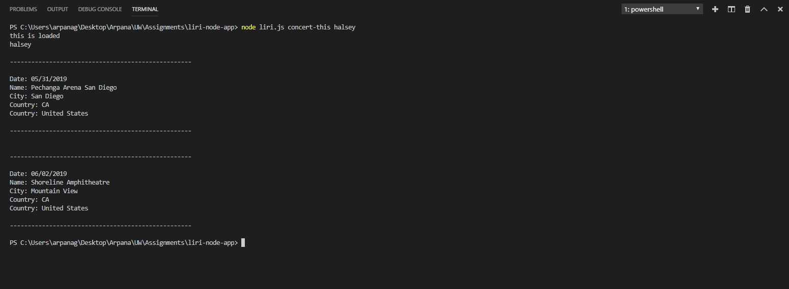
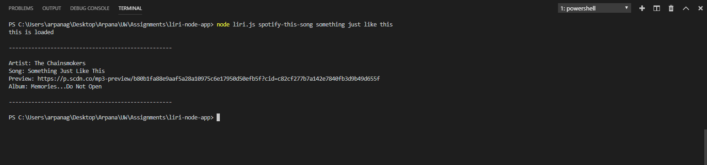
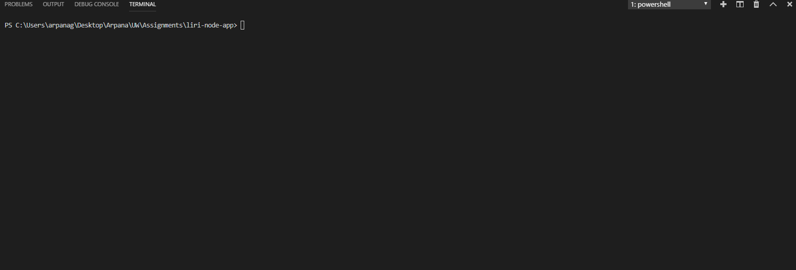
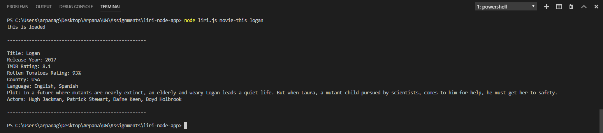
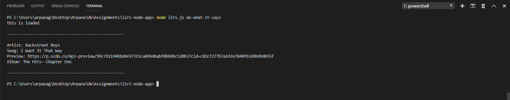

# liri-node-app

Attaching screenshot and GIF demonstarating the function of each command:

## 1. `node liri.js concert-this <artist/band name here>`
### Screenshot

## **GIF**

-------------------------------------------------------------------------------------------------------------------------------------------------------------------------------

## 2. `node liri.js spotify-this-song '<song name here>'`
## **Screenshot**

## **GIF**

-------------------------------------------------------------------------------------------------------------------------------------------------------------------------------

## 3. `node liri.js movie-this '<movie name here>'`
## **Screenshot**

## **GIF**

-------------------------------------------------------------------------------------------------------------------------------------------------------------------------------

## 4. `node liri.js do-what-it-says`
## **Screenshot**

## **GIF**

-------------------------------------------------------------------------------------------------------------------------------------------------------------------------------

# Program Logic

* Navigated to the root of your project and run `npm init -y`  this will initialize a `package.json` file for the project. The `package.json` file is required for installing third party npm packages and saving their version numbers. 

* Made a `.gitignore` file and add the following lines to it. This will tell git not to track these files, and thus they won't be committed to Github.

node_modules
.DS_Store
.env

* Made a JavaScript file named `keys.js`and ininside it inserted following:

console.log('this is loaded');
exports.spotify = {
  id: process.env.SPOTIFY_ID,
  secret: process.env.SPOTIFY_SECRET
};

* Created a file named `.env`, added the following to it, replacing the values with API keys :

# Spotify API keys

SPOTIFY_ID=your-spotify-id
SPOTIFY_SECRET=your-spotify-secret

    - This file will be used by the `dotenv` package to set what are known as environment variables to the global `process.env` object in node. These are values that are meant to be specific to the computer that node is running on, and since we are gitignoring this file, they won't be pushed to github &mdash; keeping our API key information private.

    - If someone wanted to clone your app from github and run it themselves, they would need to supply their own `.env` file for it to work.

* Made a file called `random.txt`.

   - Inside of `random.txt` put the following in with no extra characters or white space:

     spotify-this-song,"I Want it That Way"

* Made a JavaScript file named `liri.js`.

* At the top of the `liri.js` file, added code to read and set any environment variables with the dotenv package:

require("dotenv").config();

* Added the code required to import the `keys.js` file and stored it in a variable.

  var keys = require("./keys.js");

* then accessed keys information using:

  var spotify = new Spotify(keys.spotify);

* converted movie , song or concert name from array to string
var parameter = process.argv.slice(3).join(" ");

* Checked the command given in console log and switched accordingly to corresponding function using switch case
